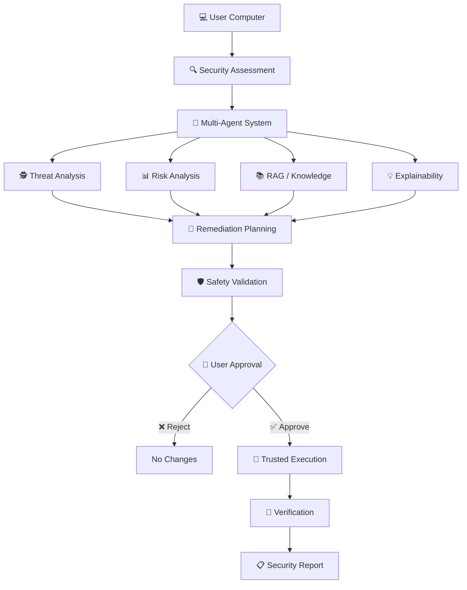
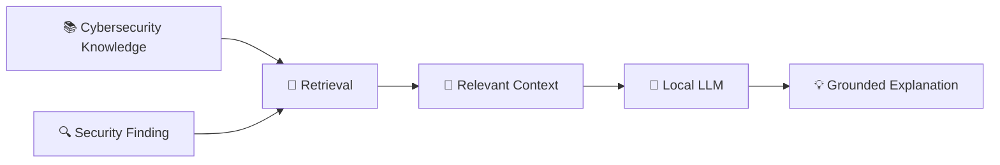

<div align="center">

# 🛡️ AegisSys

### *An Explainable Multi-Agent AI System for Intelligent Cybersecurity Assessment and Safe Threat Remediation Using LLMs*


<br>


<br><br>

> **AI that can reason about cybersecurity — without taking control away from the user.**

</div>

---

## ⚡ What is AegisSys?

AegisSys is a **privacy-oriented, explainable multi-agent AI cybersecurity system** designed to help users understand and improve the security of their computers.

Instead of simply showing:

```text
⚠ SECURITY ISSUE DETECTED
```

AegisSys aims to explain:

```text
┌───────────────────────────────────────────────┐
│              🔍 SECURITY FINDING              │
├───────────────────────────────────────────────┤
│                                               │
│  ⚠ Firewall is disabled                      │
│                                               │
│  What happened?                               │
│  Your firewall is currently disabled.         │
│                                               │
│  Why does it matter?                          │
│  It may increase exposure to unwanted         │
│  network connections.                         │
│                                               │
│  Recommended action                           │
│  Enable the firewall.                         │
│                                               │
│  🔐 Safety: User approval required            │
│                                               │
└───────────────────────────────────────────────┘
```

The goal is to combine:

**🔍 Assessment + 🤖 AI Reasoning + 📚 RAG + 💡 Explainability + 🛡️ Safety + 👤 Human Control**

---

# 🧠 How Does It Work?



---

# 🕸️ The AegisSys Agent Network

AegisSys isn't designed around one giant AI agent.

Instead, specialized components handle different responsibilities.

```mermaid
graph LR

    A["🔍 Assessment"] --> B["🕵️ Threat Analysis"]

    B --> C["📊 Risk Analysis"]

    C --> D["💡 Explainability"]

    D --> E["📚 RAG"]

    E --> F["🧠 Remediation Planner"]

    F --> G["🛡️ Safety Validator"]

    G --> H["👤 Human Approval"]

    H --> I["⚙️ Trusted Execution"]

    I --> J["🔎 Verification"]

    J --> K["📋 Report"]
```



### 🤖 Core Components

| Component                  | Responsibility                                              |
| -------------------------- | ----------------------------------------------------------- |
| 🔍 **Security Assessment** | Collect security-related system information                 |
| 🕵️ **Threat Analysis**    | Analyze suspicious or insecure findings                     |
| 📊 **Risk Analysis**       | Determine potential risk and impact                         |
| 💡 **Explainability**      | Convert technical findings into understandable explanations |
| 📚 **RAG**                 | Retrieve relevant cybersecurity knowledge                   |
| 🧠 **Remediation Planner** | Generate structured remediation plans                       |
| 🛡️ **Safety Validator**   | Validate proposed system-changing actions                   |
| 👤 **Human-in-the-Loop**   | Give the user control over sensitive actions                |
| ⚙️ **Trusted Execution**   | Execute predefined safe operations                          |
| 🔎 **Verification**        | Confirm whether remediation succeeded                       |

---

# 🔐 The Most Important Rule

### 🚫 The LLM does NOT get direct system access.

This is one of the fundamental design principles of AegisSys.

```text
                 🤖 LLM
                   │
                   ▼
           Structured Plan
                   │
                   ▼
        ┌─────────────────────┐
        │ Trusted Action      │
        │ Registry            │
        └──────────┬──────────┘
                   │
                   ▼
          🛡️ Safety Validation
                   │
                   ▼
             👤 Approval
                   │
                   ▼
        ⚙️ Trusted Function
                   │
                   ▼
             💻 System
                   │
                   ▼
           🔎 Verification
```

This means the system does **not** simply take an LLM-generated command and execute it.

---

# 🧩 Technology Stack

<div align="center">

### 🧠 AI


### 🔐 Cybersecurity


### 🧰 Development


</div>

---

# 🏗️ Project Architecture

```text
AegisSys/
│
├── 🧠 AI / Agents
│   ├── Security Assessment
│   ├── Threat Analysis
│   ├── Risk Analysis
│   ├── Explainability
│   ├── RAG
│   └── Remediation Planning
│
├── 🛡️ Safety
│   ├── Trusted Actions
│   ├── Safety Validation
│   ├── Human Approval
│   └── Verification
│
├── 💻 System
│   ├── Firewall
│   ├── Antivirus
│   ├── Processes
│   ├── Services
│   ├── Startup
│   └── Network
│
├── 🖥️ Interface
│   ├── Dashboard
│   ├── Findings
│   ├── Recommendations
│   └── Reports
│
├── 🧪 Testing
│   ├── Unit Tests
│   ├── Integration Tests
│   └── Safety Tests
│
└── 📚 Research
    ├── Architecture
    ├── Experiments
    └── Evaluation
```

---

# 🎯 What Can AegisSys Assess?

The planned assessment layer may investigate areas such as:

```text
🛡️ Firewall
🦠 Antivirus / Defender
⚙️ Running Processes
🚀 Startup Applications
🔧 System Services
🌐 Open Ports
🔌 USB Activity
🌍 Browser Security
🔑 Password / Security Policies
```

The exact scope will evolve during development and evaluation.

---

# 🧠 Local AI

AegisSys is designed around **local LLMs**.

```text
             💻 User Computer
                    │
                    ▼
             ┌──────────────┐
             │   AegisSys   │
             └──────┬───────┘
                    │
                    ▼
              🦙 Ollama
                    │
                    ▼
              🧠 Local LLM
                    │
                    ▼
             AI Reasoning
```

This architecture is intended to reduce unnecessary exposure of sensitive system information to external AI services.

---

# 📚 RAG Knowledge Layer

The AI should not depend entirely on its internal knowledge.

AegisSys will use a cybersecurity knowledge base to provide relevant information to the agents.



---

# 👤 Human-in-the-Loop

AegisSys is designed so that the **user remains in control**.

```text
        🔍 Finding
             │
             ▼
     🧠 AI Recommendation
             │
             ▼
      🛡️ Safety Analysis
             │
             ▼
      ┌───────────────┐
      │ 👤 User       │
      │               │
      │ Approve?      │
      └───────┬───────┘
          │       │
       ❌ │       │ ✅
          ▼       ▼
       Cancel   Execute
                    │
                    ▼
               🔎 Verify
```

---

# 📊 Example User Experience

### Before

```text
❌ Firewall Disabled
```

### With AegisSys

```text
┌───────────────────────────────────────────────┐
│ 🛡️ Firewall Security                         │
│                                               │
│ Status: ⚠️ Attention Required                 │
│                                               │
│ ───────────────────────────────────────────── │
│                                               │
│ 🔍 Finding                                    │
│ Firewall protection is currently disabled.   │
│                                               │
│ 💡 Why does this matter?                      │
│ A firewall helps control unwanted network     │
│ connections to your computer.                 │
│                                               │
│ 📊 Risk                                       │
│ Potentially increased network exposure.      │
│                                               │
│ 🔧 Recommendation                             │
│ Enable the firewall.                          │
│                                               │
│ 🛡️ Safety                                    │
│ This action requires user approval.           │
│                                               │
│       [ View Details ]  [ Approve ]            │
│                                               │
└───────────────────────────────────────────────┘
```

---

# 🧪 Research Areas

AegisSys is both a software project and a research-oriented project.

### Areas we are investigating

* 🤖 Multi-agent cybersecurity workflows
* 🧠 Local LLM-based security assistance
* 📚 Retrieval-Augmented Generation
* 💡 Explainable AI for cybersecurity
* 👤 Human-in-the-loop security remediation
* 🛡️ Safe AI-assisted system modification
* 🔐 Trusted action execution
* 🔎 Post-remediation verification
* 📊 Agent evaluation
* 🧪 Safety evaluation

---

# 🚧 Project Roadmap

```text
Phase 01  ████████████████████  Foundation
Phase 02  ███████████████░░░░░  Security Assessment
Phase 03  ████████████░░░░░░░░  AI / Agents
Phase 04  ██████████░░░░░░░░░░  RAG + Explainability
Phase 05  ████████░░░░░░░░░░░░  Safety + Remediation
Phase 06  ██████░░░░░░░░░░░░░░  UI
Phase 07  ████░░░░░░░░░░░░░░░░  Testing & Evaluation
Phase 08  ██░░░░░░░░░░░░░░░░░░  Final Research
```

> 🚧 **AegisSys is currently under active development.**

---

# 📂 Repository

```text
AegisSys/
│
├── src/              → Application source code
├── tests/            → Automated tests
├── docs/             → Architecture & research
├── scripts/          → Development utilities
├── data/             → Local development data
│
├── README.md
├── pyproject.toml
├── .env.example
└── .gitignore
```

---

# 🚀 Development

Clone the repository:

```bash
git clone https://github.com/NIJOY-P-JOSE/AegisSys.git
cd AegisSys
```

Create a virtual environment:

```bash
python -m venv .venv
```

Activate on Windows:

```powershell
.venv\Scripts\Activate.ps1
```

Development instructions will be expanded as the project evolves.

---

# 🤝 Team Development

Development will follow a feature-branch workflow.

```text
                 main
                  │
                  ▼
               develop
            ┌─────┼─────┐
            ▼     ▼     ▼
         feature feature feature
            │     │     │
            └─────┼─────┘
                  ▼
             Pull Request
                  │
                  ▼
              Code Review
                  │
                  ▼
               develop
                  │
                  ▼
                 main
```

---

# 🗺️ Project Status

| Area                | Status       |
| ------------------- | ------------ |
| Repository          | 🟢 Started   |
| Architecture        | 🟡 Designing |
| Security Assessment | ⚪ Planned    |
| Multi-Agent System  | ⚪ Planned    |
| Local LLM           | ⚪ Planned    |
| RAG                 | ⚪ Planned    |
| Explainability      | ⚪ Planned    |
| Safety Layer        | ⚪ Planned    |
| Remediation         | ⚪ Planned    |
| UI                  | ⚪ Planned    |
| Testing             | ⚪ Planned    |
| Research Evaluation | ⚪ Planned    |

---

# 👨‍💻 Contributors

<div align="center">

### AegisSys Team

**Built as a final-year academic & research project.**

</div>

---

# ⭐ Vision

AegisSys aims to make cybersecurity assistance:

```text
        🔍 Understandable
                +
        🧠 Intelligent
                +
        🔐 Safe
                +
        👤 User-Controlled
                +
        🛡️ Privacy-Oriented
```

### **AI should assist the user — not take control away from them.**

---

<div align="center">

**🛡️ AegisSys**

*Explain. Assess. Protect. Safely.*

</div>
